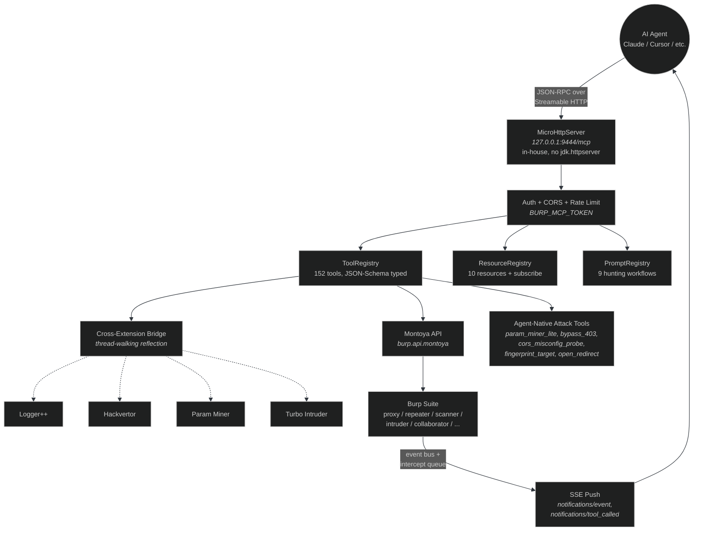
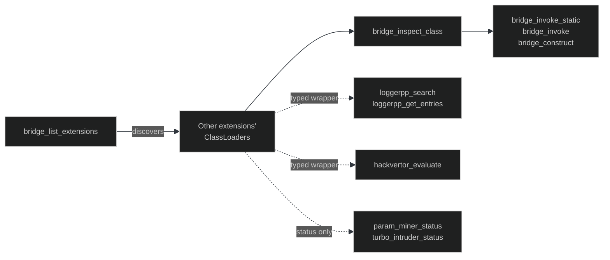

<p align="center">
  
  
  
  
  
</p>

<p align="center">
  
  
  
  
  
  
</p>

<h1 align="center">burp-mcp-ultimate</h1>

<p align="center">
  <strong>Burp Suite extension that exposes the entire Montoya API as an MCP server.</strong><br>
  Drive Burp from any MCP-aware AI agent (Claude Code, Claude Desktop, Cursor, BountyHound)<br>
  with functional 100% coverage, plus a reflection bridge into other installed Burp extensions.
</p>

<p align="center">
  <em>The Burp extension your AI agent wishes existed.</em>
</p>

<p align="center">
  <a href="#quick-start">Quick Start</a> ·
  <a href="#architecture">Architecture</a> ·
  <a href="#tool-inventory">Tools</a> ·
  <a href="#cross-extension-bridge">Bridge</a> ·
  <a href="#agent-native-attack-tools">Attack Tools</a> ·
  <a href="#comparison">Comparison</a> ·
  <a href="#citation">Citation</a>
</p>

---

## Table of Contents

- [Why burp-mcp-ultimate](#why-burp-mcp-ultimate)
- [Architecture](#architecture)
- [Quick Start](#quick-start)
- [Wire into Claude Code](#wire-into-claude-code)
- [Tool Inventory](#tool-inventory)
- [MCP Resources](#mcp-resources)
- [MCP Prompts](#mcp-prompts)
- [Cross-Extension Bridge](#cross-extension-bridge)
- [Agent-Native Attack Tools](#agent-native-attack-tools)
- [Configuration](#configuration)
- [Right-Click Integration](#right-click-integration)
- [Structured Error Codes](#structured-error-codes)
- [Smoke Tests](#smoke-tests)
- [Security Notes](#security-notes)
- [Comparison](#comparison)
- [Limitations](#limitations)
- [Roadmap](#roadmap)
- [Citation](#citation)
- [Acknowledgements](#acknowledgements)
- [License](#license)

---

## Why burp-mcp-ultimate

Other Burp MCP servers wrap a thin slice of Montoya — the official PortSwigger reference exposes a few dozen tools, third-party clones similar. That's enough for a chatbot to summarize proxy history, not enough for an autonomous agent to actually drive a hunt. burp-mcp-ultimate does five things differently:

1. **Functional 100% coverage of the Montoya API.** 152 first-class typed tools cover the common operations; a reflection escape hatch (`montoya_invoke` / `montoya_invoke_static`) reaches every Java method we did not pre-wrap, with score-based overload resolution. If PortSwigger ships it tomorrow, the agent can call it tomorrow without a recompile.

2. **Cross-extension reflection bridge.** Burp deliberately isolates extensions so they can ship conflicting dependencies safely. We walk thread classloaders to discover other loaded extensions (Logger++, Hackvertor, Param Miner, Turbo Intruder, JWT Editor) and reflect into them. The agent calls into the real extensions, not just our own surface.

3. **Agent-native attack tools that don't depend on third-party extensions.** `param_miner_lite`, `bypass_403`, `cors_misconfig_probe`, `fingerprint_target`, `open_redirect_probe` — five tools that replicate the most common manual workflows so the agent works on a vanilla Burp install with zero extensions.

4. **Hold-and-decide intercept queue.** `intercept_set_mode hold_both` pauses the proxy thread; the agent decides via `intercept_resolve` with optional modified bytes, with a 30s timeout fail-open so the proxy can never deadlock. The agent can rewrite traffic mid-flight.

5. **Self-contained transport layer.** Burp ships a jlink'd JRE that excludes `jdk.httpserver`. Rather than asking users to fix their JVM, we ship a 250-line in-house `MicroHttp.kt` HTTP/1.1 server with Streamable HTTP / SSE support. Zero runtime dependencies that aren't in `java.base`.

If you want a pretty proxy-history viewer, install the official PortSwigger MCP. If you want an AI agent that can actually run an end-to-end hunt — recon, fuzz, find, exploit, report — read on.

---

## Architecture



**Nine layers between the agent and Burp's APIs:**

1. **First-class typed tools** (152 named, JSON-Schema input). The common operations.
2. **Composite tools** (~5) wrap Montoya's many `with*` builder methods.
3. **Reflection escape hatch** (`montoya_invoke`, `montoya_invoke_static`, `montoya_inspect`, `montoya_list_methods*`) dispatches any Java method by name.
4. **Cross-extension bridge** walks running threads to find other extensions' classloaders.
5. **Callback bridge / event bus** converts Burp's handler-style APIs into a poll-based stream (also pushed live over SSE).
6. **Hold-and-decide intercept queue** with 30s timeout fail-open.
7. **Editor capture via right-click** — the agent reads/modifies what the user is staring at.
8. **MCP Resources** — read-only data the model auto-pulls into context. Subscribe/unsubscribe with change notifications.
9. **MCP Prompts** — canned hunting workflows (`audit_auth_flow`, `find_idor_pairs`, `find_ssrf`, ...).

Returned objects that are non-primitive get stored in a **handle store**; the agent passes `{"$handle": "h12"}` to chain operations across tool calls.

---

## Quick Start

### 1. Build

```powershell
git clone https://github.com/AshtonVaughan/burp-mcp-ultimate.git
cd burp-mcp-ultimate
./gradlew test           # 62 unit + integration tests
./gradlew shadowJar      # build/libs/burp-mcp-ultimate-0.2.0.jar
```

JDK 21 required. Gradle wrapper is committed. Override the Montoya version with `-PmontoyaVersion=2024.12` if needed.

### 2. (Recommended) Set a bearer token before launching Burp

```powershell
$env:BURP_MCP_TOKEN = "$(-join ((48..57)+(65..90)+(97..122) | Get-Random -Count 40 | ForEach-Object {[char]$_}))"
$env:BURP_MCP_TOKEN  # copy this — you need it in step 4
& "C:\Program Files\BurpSuitePro\BurpSuitePro.exe"
```

Default bind is `127.0.0.1` so the server isn't network-exposed, but a token stops any local process from driving Burp without permission. Skip on solo dev machines if you want.

### 3. Load the extension

In Burp: **Extensions -> Installed -> Add -> Java -> select the shadow JAR.** Output should show:

```
[burp-mcp-ultimate] http://127.0.0.1:9444/mcp  tools=152 resources=10 prompts=9  token=ON ...
```

A new top-level **MCP** suite tab appears with endpoint, sessions, tool calls, handles, SSE clients, intercept state, event channels.

### 4. Wire into your MCP client

See [Wire into Claude Code](#wire-into-claude-code) below. You're done.

---

## Wire into Claude Code

```jsonc
// ~/.claude.json
{
  "mcpServers": {
    "burp": {
      "type": "http",
      "url":  "http://127.0.0.1:9444/mcp?token=YOUR_TOKEN_HERE"
    }
  }
}
```

> **Use `"type": "http"`, not `"type": "sse"`.** This server speaks the MCP **Streamable HTTP** transport (POST = JSON-RPC request/response, optional GET = SSE for server-initiated notifications, same URL). The `"type": "sse"` value selects the legacy MCP-over-SSE transport that expects the server to emit an `event: endpoint` frame first, which this server does not. Using `"sse"` will hang at "connecting…" with no error.

Restart Claude Code after editing the config. `/mcp` will list `burp` as connected and 152 `mcp__burp__*` tools become callable in any new session.

---

## Tool Inventory

| Surface | Tools |
|---|---|
| **HTTP** | `http_send_raw`, `http_send_with_session_handling`, `http_send_batch`, `http_send_race`, `http_url_to_request`, `cookie_jar_list`, `cookie_jar_set` |
| **GraphQL** | `graphql_introspect`, `graphql_query`, `graphql_batched_query`, `graphql_field_suggestions` |
| **OAuth / OIDC** | `oidc_discover`, `oauth_decode_access_token`, `oauth_build_pkce`, `oauth_token_exchange` |
| **JWT** | `util_jwt_decode`, `jwt_verify`, `jwt_sign`, `jwt_alg_confusion`, `jwt_kid_inject`, `jwt_jwks_fetch` |
| **Diff** | `diff_text`, `diff_responses` |
| **JS analysis** | `js_extract_endpoints`, `js_scan_secrets`, `js_scan_response` |
| **Editor** | `editor_describe`, `editor_get_request`, `editor_get_response`, `editor_set_request`, `editor_set_response`, `editor_clear_capture` |
| **Intercept** | `intercept_set_mode`, `intercept_status`, `intercept_pending_list`, `intercept_get_full`, `intercept_resolve` |
| **Annotations** | `annotation_set`, `annotation_get` |
| **Events** | `events_subscribe`, `events_poll`, `events_unsubscribe`, `events_list_channels`, `events_list_subscriptions` |
| **Persistence** | `notes_*`, `persist_set/get_int/bool/request/response/request_response`, `persist_keys`, `persist_delete` |
| **Reflection (Montoya)** | `montoya_invoke`, `montoya_invoke_static`, `montoya_inspect`, `montoya_list_methods`, `montoya_list_methods_of_class` |
| **Cross-extension Bridge** | `bridge_list_extensions`, `bridge_inspect_class`, `bridge_invoke_static`, `bridge_invoke`, `bridge_construct`, `bridge_get_field`, `bridge_set_field`, `bridge_get_static_field`, `bridge_refresh` |
| **Logger++ wrapper** | `loggerpp_status`, `loggerpp_get_entries`, `loggerpp_search` |
| **Hackvertor wrapper** | `hackvertor_status`, `hackvertor_evaluate` |
| **Param Miner / Turbo Intruder wrappers** | `param_miner_status`, `turbo_intruder_status` |
| **Agent-native attack** | `param_miner_lite`, `bypass_403`, `cors_misconfig_probe`, `fingerprint_target`, `open_redirect_probe` |
| **Burp diagnostics** | `burp_version`, `burp_command_line_arguments`, `burp_task_engine_state`, `project_name`, `server_diagnostics` |
| **Plus** | Proxy, Repeater, Intruder (incl. `intruder_send_template` with positions), Scanner, Collaborator, Sitemap, Scope, WebSockets (read+write), Organizer, Comparer, Decoder, Logger, Util / UtilExt |

(Full alphabetical list at runtime via `tools/list`.)

---

## MCP Resources

| URI | Content |
|---|---|
| `burp://proxy/history` | Last 200 proxy items |
| `burp://sitemap` | First 500 sitemap nodes |
| `burp://scan/issues` | All scanner issues |
| `burp://issues/critical` | High + Critical only |
| `burp://websockets/active` | WS frame counts per upgrade URL |
| `burp://target_summary` | Top hosts by request count |
| `burp://collaborator/server` | Collaborator hostname info |
| `burp://scope` | Scope-enumeration limit note |
| `burp://handles` | Currently stored handles |
| `burp://intercept/pending` | Pending intercept queue |

Subscribe via `resources/subscribe { uri }` to get live notifications when content changes.

---

## MCP Prompts

`audit_auth_flow`, `find_idor_pairs`, `find_ssrf`, `analyze_jwt`, `audit_oauth_flow`, `find_race_conditions`, `audit_file_upload`, `analyze_graphql_schema`, `analyze_response`

---

## Cross-Extension Bridge

The bridge gives the MCP agent reflection-based access into other Burp extensions, working around Montoya's deliberate isolation between extensions. Burp loads each extension into its own ClassLoader so they can ship conflicting dependencies safely; we walk running threads to discover those loaders and reflect into them.



Status of currently-supported extensions:

| Extension | Status | Tools |
|---|---|---|
| **Logger++** | ✓ | `loggerpp_status`, `loggerpp_get_entries`, `loggerpp_search` |
| **Hackvertor** | ✓ | `hackvertor_status`, `hackvertor_evaluate` |
| **Param Miner** | ⚠ status only | UI-bound actions are unreachable from Montoya. Agent-native `param_miner_lite` covers the headline use cases. |
| **Turbo Intruder** | ⚠ status only | Tab-driven Python scripts. `http_send_race` covers most race-condition cases natively. |
| **JWT Editor** | redundant | Use `mcp__burp__jwt_*` (sign / verify / alg_confusion / kid_inject / jwks_fetch). |
| **InQL** | redundant | Use `mcp__burp__graphql_introspect` / `graphql_query`. |
| **Active Scan++ / HRS / BPS** | passive | Auto-fires on agent-triggered scans. No bridge call needed. |
| **Collaborator Everywhere** | passive (best pairing) | Auto-injects payloads on every in-scope outbound request. Set scope first, then the agent's MCP HTTP traffic gets payloads automatically. |

Full status table, caveats and discovery flow in [`docs/EXTENSION_BRIDGE.md`](docs/EXTENSION_BRIDGE.md). Smoke verifier in [`docs/BRIDGE_SMOKE_PROMPT.md`](docs/BRIDGE_SMOKE_PROMPT.md).

---

## Agent-Native Attack Tools

Five attack tools that don't depend on any third-party extension. They replicate the most common manual workflows from Param Miner / 403-bypass scripts / CORS test pages so the AI agent works on a vanilla Burp install.

| Tool | Purpose | Wordlist / Payload count |
|---|---|---|
| `param_miner_lite` | Bulk-probe headers or parameters with anomaly detection (status / body length / header reflection of an injected canary). Lightweight alternative to PortSwigger's right-click-only Param Miner. | 100+ headers, 70+ params |
| `bypass_403` | 30+ documented 403/401 bypass tricks: path encoding (`%2e %2f ..;/` etc.), header tricks (`X-Original-URL`, `X-Custom-IP-Authorization`, `X-Forwarded-For: 127.0.0.1`), method overrides, capitalization. | 30+ variants |
| `cors_misconfig_probe` | 8 attacker-origin variants. Severity-graded: **critical** if reflection + `Allow-Credentials: true`, **noteworthy** if `*` + credentials, **info** otherwise. | 8 origins |
| `fingerprint_target` | First-look recon in one tool call: tech-stack from headers, robots.txt, sitemap.xml, security.txt, openid-configuration, common admin paths, baseline-404 calibration, WAF/CDN markers. Replaces ~10 manual `http_send_raw` calls. | 16 probes |
| `open_redirect_probe` | 13 redirect-bypass payloads against a URL parameter. Reports exploitable variants vs partial. | 13 payloads |

All five route through `HttpTools.normalizeRawRequest` so LF-only inputs from sloppy AI-generated requests get auto-fixed.

---

## Configuration

Server config via env vars or `-D` system properties (read in `mcp/Config.kt`):

| Variable | Default | Purpose |
|---|---|---|
| `BURP_MCP_HOST` | `127.0.0.1` | Bind address |
| `BURP_MCP_PORT` | `9444` | Port |
| `BURP_MCP_TOKEN` | (none) | Bearer token (also accepted as `?token=...` query) |
| `BURP_MCP_CORS_ORIGINS` | `*` | Comma-separated allow-list, or `*` |
| `BURP_MCP_RATE_LIMIT` | `0` (off) | Max tool calls per session per 10 s |
| `BURP_MCP_EDITOR_STALE_SECONDS` | `600` | Editor capture is rejected after this age |

```powershell
$env:BURP_MCP_TOKEN       = "your-long-random-token"
$env:BURP_MCP_CORS_ORIGINS = "http://localhost:3000,https://localhost:9777"
$env:BURP_MCP_RATE_LIMIT  = "120"
& "C:\Program Files\BurpSuitePro\BurpSuitePro.exe"
```

System properties take precedence over env vars.

---

## Right-Click Integration

Three menu items added to Burp's right-click everywhere:

| Menu item | Effect |
|---|---|
| **AI: capture this editor** | Stash the editor reference; `editor_get_request/set_request` work against it. |
| **AI: send N item(s)** | Store selected requests as handles, push a `context_menu` event. |
| **AI: send N issue(s)** | Same for scan issues. |

---

## Structured Error Codes

Beyond JSON-RPC standard codes:

| Code | Meaning |
|---|---|
| `-32001` | UNAUTHORIZED |
| `-32002` | NOT_FOUND (handle / resource / prompt / tool) |
| `-32003` | VALIDATION (arg fails business validation) |
| `-32004` | TARGET_ERROR (remote target failed) |
| `-32005` | RATE_LIMITED |
| `-32006` | STALE (editor capture / handle past TTL) |
| `-32007` | MONTOYA_ERROR (Burp threw) |

---

## Smoke Tests

```powershell
# initialize
curl -s -X POST http://127.0.0.1:9444/mcp -H "Content-Type: application/json" `
  -d '{"jsonrpc":"2.0","id":1,"method":"initialize"}'

# resources + prompts
curl -s -X POST http://127.0.0.1:9444/mcp -H "Content-Type: application/json" `
  -d '{"jsonrpc":"2.0","id":2,"method":"resources/list"}'
curl -s -X POST http://127.0.0.1:9444/mcp -H "Content-Type: application/json" `
  -d '{"jsonrpc":"2.0","id":3,"method":"prompts/list"}'

# enable hold-both intercept
curl -s -X POST http://127.0.0.1:9444/mcp -H "Content-Type: application/json" `
  -d '{"jsonrpc":"2.0","id":4,"method":"tools/call","params":{"name":"intercept_set_mode","arguments":{"mode":"hold_requests"}}}'

# subscribe to scan_issue events
curl -s -X POST http://127.0.0.1:9444/mcp -H "Content-Type: application/json" `
  -d '{"jsonrpc":"2.0","id":5,"method":"tools/call","params":{"name":"events_subscribe","arguments":{"channel":"scan_issue"}}}'

# reach a method we did not pre-wrap (Proxy.isInterceptEnabled)
curl -s -X POST http://127.0.0.1:9444/mcp -H "Content-Type: application/json" `
  -d '{"jsonrpc":"2.0","id":6,"method":"tools/call","params":{"name":"montoya_invoke","arguments":{"target":"api","method":"proxy"}}}'

# self-diagnostic (server health, thread count, queue state, JVM memory)
curl -s -X POST http://127.0.0.1:9444/mcp -H "Content-Type: application/json" `
  -d '{"jsonrpc":"2.0","id":7,"method":"tools/call","params":{"name":"server_diagnostics","arguments":{}}}'
```

---

## Security Notes

- Default bind is `127.0.0.1`. Do not expose to the network.
- If you must, set a token AND lock CORS to specific origins AND put TLS on a reverse proxy.
- The agent operates with full Burp privileges. Treat any AI client connected to it as if it were you, sitting at the keyboard.
- The cross-extension bridge uses `setAccessible(true)` for private-field access. Use `bridge_set_field` sparingly — writing to another extension's private state can violate its invariants.

---

## Comparison

| Capability | burp-mcp-ultimate | [PortSwigger/mcp-server](https://github.com/PortSwigger/mcp-server) | [six2dez/burp-ai-agent](https://github.com/six2dez/burp-ai-agent) | [swgee/BurpMCP](https://github.com/swgee/BurpMCP) |
|---|:-:|:-:|:-:|:-:|
| First-class typed tools | **152** | ~30 | ~25 | ~20 |
| Reflection escape hatch (any Montoya method) | ✅ | ❌ | ❌ | ❌ |
| Cross-extension bridge (Logger++, Hackvertor, …) | ✅ | ❌ | ❌ | ❌ |
| Hold-and-decide intercept queue | ✅ | partial | ❌ | ❌ |
| Streamable HTTP transport (MCP 2024-11-05) | ✅ | ✅ | ✅ | ✅ |
| SSE push (server-initiated notifications) | ✅ | partial | ❌ | ❌ |
| Right-click "send to AI" / editor capture | ✅ | partial | ❌ | partial |
| MCP Resources with `subscribe` | ✅ (10) | ❌ | ❌ | ❌ |
| MCP Prompts (canned hunting workflows) | ✅ (9) | ❌ | ❌ | ❌ |
| Agent-native attack tools (no-extension required) | ✅ (5) | ❌ | ❌ | ❌ |
| Runs on Burp Community (no Pro license) | ✅ | ✅ | ❌ | partial |
| In-house HTTP server (no `jdk.httpserver`) | ✅ | ❌ | ❌ | ❌ |
| Per-session log + rate limiter + bearer auth | ✅ | partial | ❌ | partial |
| Unit + integration tests | **62** | partial | ❌ | partial |
| Compiled JAR size | ~9 MB | ~5 MB | ~3 MB | ~7 MB |

---

## Limitations

Honest list of what this extension **cannot** do or has caveats around:

- **Real Montoya gaps the API doesn't expose.** Scope rule enumeration (`scope_is_in_scope` works, *listing* rules does not). BCheck listing / enable / disable (import only). Intruder attack-result table readback (launch only). Scanner pause/resume per task (delete + status only). Burp AI assistant API. BApp Store enumeration / install. Bambdas (Burp's filter DSL) execution. Cookie attributes beyond name/value/domain/path. All become reachable via `montoya_invoke` the moment PortSwigger ships them.
- **Cross-extension bridge is fragile by design.** Third-party extensions' internal class names change between releases. Generic `bridge_invoke` is the durable fallback — even if a typed wrapper breaks, the agent can still drive any extension via raw reflection by inspecting its classes first. See [`docs/EXTENSION_BRIDGE.md`](docs/EXTENSION_BRIDGE.md).
- **Param Miner's headline actions are right-click only.** Montoya cannot trigger context-menu items in another extension. The agent-native `param_miner_lite` covers the common header/parameter probing use cases instead.
- **Turbo Intruder requires its UI tab.** Tab-driven Python script execution; programmatic launch is high-effort and largely redundant since `http_send_race` covers most race-condition cases natively.
- **Burp Community restrictions on Pro-only Montoya surfaces.** Scanner, Intruder, Collaborator, macro-driven session handling all return `MONTOYA_ERROR (-32007)` on Community edition. Detected and surfaced clearly so the agent doesn't silently drop calls.
- **MCP transport must be `"type": "http"` not `"sse"`.** Modern Streamable HTTP, not legacy MCP-over-SSE-with-endpoint-event. The wrong type hangs at "connecting…" with no error.

---

## Roadmap

**Q2 2026**

- [ ] Bambdas execution wrapper once Montoya exposes the API
- [ ] Native `idor_compare(handle_a, handle_b)` agent-native tool (compare same request as two users)
- [ ] `subdomain_takeover_probe` agent-native tool (CNAME-pointing-to-deleted-resource detection)
- [ ] Per-extension typed wrapper for InQL once a stable API surface is identified

**Q3 2026**

- [ ] Bidirectional WebSocket frame interception (currently read+write but not hold-and-decide)
- [ ] Distributed agent mode: one Burp instance, multiple agents driving different scopes concurrently
- [ ] Live integration with HackerOne API for direct submission from agent context

**Backlog**

- [ ] First-class wrapper for Burp's AI assistant API once Montoya exposes it
- [ ] Browser-based agentic-injection harness (drive Burp's embedded Chromium from the agent)
- [ ] OpenTelemetry export of tool-call traces

---

## Citation

If you use burp-mcp-ultimate in published research:

```bibtex
@software{burpmcpultimate2026,
  title  = {burp-mcp-ultimate: Burp Suite Pro extension exposing the Montoya API as an MCP server},
  author = {Vaughan, Ashton},
  year   = {2026},
  url    = {https://github.com/AshtonVaughan/burp-mcp-ultimate}
}
```

---

## Acknowledgements

Patterns and naming influenced by reading the public docs of:

- [PortSwigger/mcp-server](https://github.com/PortSwigger/mcp-server) — Apache 2.0
- [six2dez/burp-ai-agent](https://github.com/six2dez/burp-ai-agent) — MIT
- [swgee/BurpMCP](https://github.com/swgee/BurpMCP) — MIT

The cross-extension bridge concept was prompted by an autonomous overnight bug-bounty session that ran into the Montoya extension-isolation wall and made the case for breaking through it surgically.

---

## License

MIT. See [LICENSE](LICENSE).

This tool is for **authorized security testing only**. The agent operates with full Burp privileges; treat any AI client connected to it as if it were you sitting at the keyboard.

---

<p align="center">
  <em>Built for security researchers whose AI agents need real Burp, not a chat wrapper.</em>
</p>
